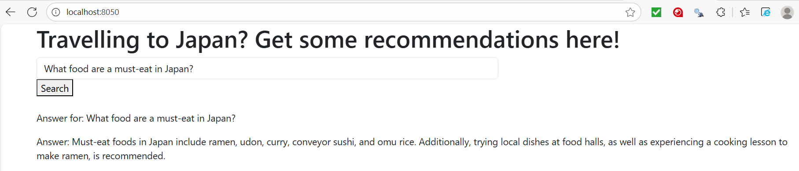

# travel-recommendations-japan
A hybrid RAG-based travel recommendation system using Qdrant, Dash, and OpenAI built as a part of LLM Zoomcamp

# Recommendations for Travelling in Japan

Ever felt overwhelmed by planning an itinerary for Japan?
Traveling in Japan offers countless options — from historic temples in Kyoto, bustling streets in Tokyo, relaxing hot springs in Hakone, to hidden gems off the beaten path. With so many choices, it can be difficult for travelers to know where to start, which destinations are worth prioritizing, and how to find recommendations that suit their personal interests.

Existing online resources such as travel blogs, forums, and guidebooks are useful but can be scattered, inconsistent, or outdated. Travelers often spend hours sifting through Reddit threads, TripAdvisor reviews, or YouTube vlogs, only to end up more confused than when they started.

This project aims to simplify the process by building an intelligent search-and-answer system based on Reddit posts created by travellers on the JapanTravel subreddit. Instead of manually browsing multiple posts, users can enter their travel questions (e.g., “What are the best day trips from Tokyo?” or “Where can I try authentic onsen in Hokkaido?”) and get direct, curated responses generated through a retrieval-augmented generation (RAG) pipeline.

By combining vector search (Qdrant) with keyword search, the system retrieves relevant information from community-sourced travel data and generates helpful recommendations in real time. This approach reduces the burden on travelers and makes planning more interactive and efficient.

This project was implemented for [LLM Zoomcamp](https://github.com/DataTalksClub/llm-zoomcamp) - a free course about LLMs and RAG.

## Dataset
The dataset was scraped from the JapanTravel subreddit. The all-time top posts, top posts of the year and top posts of the month were chosen. The title, post content and the top 5 comments for each post were scraped. See `reddit_scraping.ipynb`.

The dataset was processed for the retrieval step in `travel_rec.ipynb`. The dataset ended up consisting of these columns:
- `id`: reddit post id
- `title`: title of the reddit post
- `selftext`: content of the reddit post
- `comments_combined`: top 5 comments of the reddit post

You can find the data in `data/japantravel_posts_with_comments.csv`

## Technologies

- Python 3.10
- Docker and Docker Compose for containerization
- Dash as the web application interface
- Qdrant for vector similarity search (RAG)
- OPENAI for LLM responses

## Evaluation of retrieval methods
Three retrieval methods were evaluated - MinSearch, Vector Search and Hybrid Search. The LLM responses were evaluated using OpenAI's `gpt-4o-mini` model.

The MRR and cosine similarity can be found in `travel_rec.ipynb`. The summarized results are in the table below. Due to LLM token limits, I ran a sample of 80 documents to get the following results. 

| Retrieval method | Mean Reciprocal Rank (MRR) | Cosine Similarity |
| --- | --- | --- |
| MinSearch | 0.300 | 0.036 |
| Vector Search | 0.625 | 0.702 |
| Hybrid Search | 0.810 | 0.710 |

*Observations*:
- Hybrid Search performed the best, combining dense (`jina-small embeddings`) and sparse (`bm25`) vector configurations.
- For indexing in vector search and hybrid search, each of the documents (title + content + combined comments) is split into overlapping chunks of 200 words with a 20-word overlap. This chunking strategy is implemented in `data_ingestion.py`.

## Running the application
1. `docker run -p 6333:6333 -p 6334:6334 -v "$(pwd)/qdrant_storage:/qdrant/storage:z" qdrant/qdrant` to start qdrant. Proceed to the next step after qdrant has loaded completely.
2. `docker build -t travel-rec-app .` to build the image for the app interface
3. In a new window, run `docker run -it --rm -p 8050:8050 -e OPENAI_API_KEY="your_openai_api_key" travel-rec-app` to launch the app, replacing `your_openai_api_key` with your own openai api key
3. Open a web browser and go to [http://localhost:8050](http://localhost:8050).

You will see this:

  

You can key in your query about travelling in Japan and press search. You will be able to see the response, like this

  

If you're using a different LLM, you can try to amend:
- `requirements.txt` to add the packages required for your model
- `retrieval.py`: lines 5 and 9 (importing packages and initiating LLM client), line 66 (the content in the llm response function)
- the api key in the command in step 2 above

## Code
- `data_ingestion.py` – handles loading, processing, and indexing the documents into the retrieval system (Qdrant), including chunking text and upserting vectors.
- `retrieval.py` – implements the retrieval logic, including vector search, building prompts for the LLM, and generating RAG-based responses.
- `app.py` – provides the Dash web interface for users to submit queries, display retrieved documents, and show LLM-generated answers.
- `reddit_scraping.ipynb` - scrapes posts from JapanTravel subreddit. Data is saved in `data/japantravel_posts_with_comments.csv`.
- `travel_rec.ipynb` - evaluation of MinSearch, Vector Search and Hybrid Search.
- `ground_truth.ipynb` - generates ground truth data for evaluating responses of LLM. Ground truth data is saved in `data/ground_truth.csv`. 

## Other files
- `Dockerfile` for the web application interface
